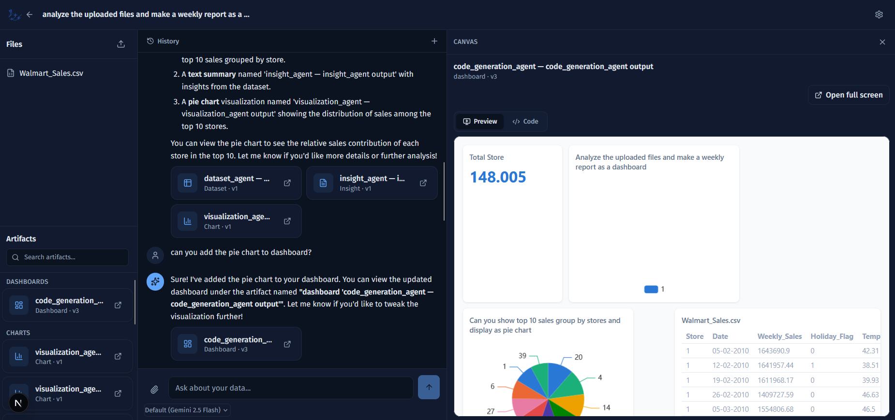

# DHANTI

**An AI-powered data & document workspace.** Upload a spreadsheet, CSV, or PDF, describe what you want in plain language, and DHANTI builds live dashboards, answers questions, and generates insights — backed by a multi-agent pipeline that only spends as much AI reasoning as a request actually needs.



## What DHANTI does

Describe what you want ("analyze the uploaded files and make a weekly report as a dashboard") and DHANTI automatically creates a workspace, parses your files, and starts working — no forms, no setup, ChatGPT/Claude-style.

### Chat-driven workspace creation
The landing page doubles as the composer: type a message or attach a file and a workspace is created for you automatically, with the conversation dropping straight in.

### File ingestion
Upload CSV, XLSX/XLS, or PDF files. Spreadsheets are profiled automatically — column types, statistics, outliers, missing values — and PDFs are chunked and indexed for retrieval. Data is queried live via an embedded DuckDB engine, never dumped wholesale into an LLM prompt.

### Multi-agent AI pipeline
A LangGraph-orchestrated pipeline of specialist agents handles requests:

| Agent | Job |
|---|---|
| `file_agent` | Resolves and prepares an uploaded file |
| `dataset_agent` | Profiles a dataset (stats, outliers, missing values) |
| `document_agent` | Indexes a document's chunks for retrieval |
| `insight_agent` | Reasons over a dataset's profile to surface patterns and trends |
| `visualization_agent` | Chooses a chart type and builds a live, data-backed chart |
| `widget_planner_agent` | Decides which widgets (table/chart/metric) a dashboard needs |
| `text_to_sql_agent` | Turns a widget spec into a validated, read-only SQL query |
| `dashboard_agent` | Plans a dashboard's layout |
| `code_generation_agent` | Writes the dashboard as a self-contained HTML/CSS/JS app |
| `dashboard_revision_agent` | Applies natural-language edits to an existing dashboard |
| `dataset_qa_agent` | Answers a single factual question with one generated SQL query |

### Smart execution routing
Not every request needs the full agent pipeline. A deterministic router (no LLM call to decide) classifies each request before any AI runs:

- **Simple query** ("how many rows?", "top 10 stores by sales") — answered directly via a rule-based query parser and DuckDB. Zero LLM calls when confidently parsed.
- **Single agent** ("summarize this document", "give me insights") — routes straight to the one agent needed, skipping intent classification and planning.
- **Code generation** ("add that chart to the dashboard") — revises an existing dashboard directly.
- **Multi-agent** (building a new dashboard from scratch, comparisons) — the full intent-analysis → planning → multi-agent pipeline.

This keeps everyday questions fast and cheap while still supporting complex, multi-step requests.

### Live dashboards, not static reports
A dashboard is a real, self-contained web app: widgets fetch their own data live from the backend at render time (via a sandboxed Bridge API), so a dashboard always reflects current data instead of a frozen snapshot. Dashboards render inside a sandboxed iframe with a strict Content-Security-Policy — no arbitrary network access, no eval, just the widget data contract.

### Canvas: code + preview
Every generated dashboard is inspectable — flip between a live preview and the actual generated HTML/CSS/JS in an in-app code editor. Any artifact (dataset table, chart, text insight, document, dashboard) opens in the same Canvas panel.

### Widgets
Charts and tables aren't just pictures — every visualization is backed by a real, versioned SQL widget that can be reused across dashboards, re-executed on demand, and safely referenced by future revisions.

### Multi-provider AI with automatic fallback
LLM calls are routed through a provider-agnostic layer with automatic failover (e.g. Gemini primary, Groq fallback) so a rate limit or outage on one provider doesn't take the whole app down. Per-message model overrides are supported (Gemini, GLM, Groq/Qwen, Llama, GPT-OSS).

### Workspace memory
Durable facts worth remembering (goals, preferences, recurring context) are automatically extracted from conversations and recalled in future turns within the same workspace.

## Architecture

```
                    ┌──────────────┐
   User message ──▶ │  Execution   │  deterministic routing, no LLM call
                    │   Router     │
                    └──────┬───────┘
             ┌─────────────┼─────────────────┬───────────────┐
             ▼             ▼                 ▼                ▼
      Simple Query   Single Agent    Code Generation     Multi-Agent
      (DuckDB, 0     (1 agent,      (dashboard          (intent →
       LLM calls)     no planning)   revision)            planning →
                                                            full pipeline)
```

**Backend** — FastAPI + LangGraph orchestrator, async SQLAlchemy over PostgreSQL (Neon), Supabase file storage, Qdrant vector search, DuckDB for live data queries, loguru logging.

**Frontend** — Next.js (App Router) + React, Tailwind CSS v4, a sandboxed iframe Canvas with a postMessage Bridge API, Monaco for code viewing, ECharts for visualizations.

## Tech stack

| Layer | Technology |
|---|---|
| Backend framework | FastAPI, Uvicorn |
| Orchestration | LangGraph |
| Database | PostgreSQL (Neon) via SQLAlchemy (async) + Alembic |
| File storage | Supabase Storage |
| Vector search | Qdrant |
| Embeddings | Hugging Face (`BAAI/bge-m3`) |
| Local data queries | DuckDB, pandas, pyarrow |
| LLM providers | Gemini, GLM, Groq, OpenRouter (config-driven, swappable) |
| Frontend framework | Next.js 16, React 19 |
| Styling | Tailwind CSS v4 |
| Charts | ECharts |
| Code editor | Monaco |

## Getting started

### Prerequisites

- Python 3.10+
- Node.js 20+
- A PostgreSQL database (e.g. [Neon](https://neon.tech))
- A [Supabase](https://supabase.com) project (file storage)
- A [Qdrant](https://cloud.qdrant.io) cluster (vector search)
- API keys for at least one LLM provider (Gemini, GLM, Groq, or OpenRouter) and Hugging Face (embeddings)

### Backend setup

```bash
cd backend
python3 -m venv .venv
source .venv/bin/activate        # Windows: .venv\Scripts\activate
pip install -r requirements.txt

cp .env.example .env
# Fill in .env with your database, storage, vector DB, and LLM provider credentials

alembic upgrade head              # apply database migrations
uvicorn app.main:app --reload --host 0.0.0.0 --port 8000
```

The API is now running at `http://localhost:8000`.

### Frontend setup

```bash
cd frontend
npm install
npm run dev
```

The app is now running at `http://localhost:3000`.

### Configuration reference

All backend configuration lives in `backend/.env` (see `backend/.env.example` for the full list). Key sections:

- **Database** — `DATABASE_URL` (async Postgres connection string)
- **Storage** — `SUPABASE_URL`, `SUPABASE_SERVICE_KEY`, `SUPABASE_BUCKET`
- **LLM providers** — one block per provider (`GEMINI_*`, `GLM_*`, `GROQ_*`, `OPENROUTER_*`); `LLM_PROVIDER` (in `app/core/config.py`) selects the active provider/fallback chain
- **Vector search** — `QDRANT_URL`, `QDRANT_API_KEY`, `QDRANT_COLLECTION`
- **Embeddings** — `HF_API_KEY`, `HF_EMBEDDING_MODEL`
- **AI tuning** — `AI_MAX_TOKENS`, `AI_TEMPERATURE`, `AI_CONTEXT_TOKEN_BUDGET`, `AI_EXECUTION_TIMEOUT_SECONDS`

## Running tests

```bash
# Backend
cd backend && pytest

# Frontend
cd frontend && npm test
```

## Project structure

```
Dhanti/
├── backend/
│   ├── app/
│   │   ├── ai/            # orchestrator, execution router, agents, planning
│   │   ├── api/            # FastAPI routes
│   │   ├── core/           # config, database, logging
│   │   ├── models/         # SQLAlchemy models
│   │   ├── providers/      # LLM/embedding/vector/storage provider abstractions
│   │   └── services/       # business logic (widgets, files, chat, memory, ...)
│   ├── alembic/             # database migrations
│   └── tests/
├── frontend/
│   └── src/
│       ├── app/             # Next.js routes (landing, workspace, settings)
│       ├── components/      # chat, canvas, artifacts, workspace panels
│       └── lib/             # API client, canvas sandbox/bridge, utilities
└── shared/                  # shared assets
```
