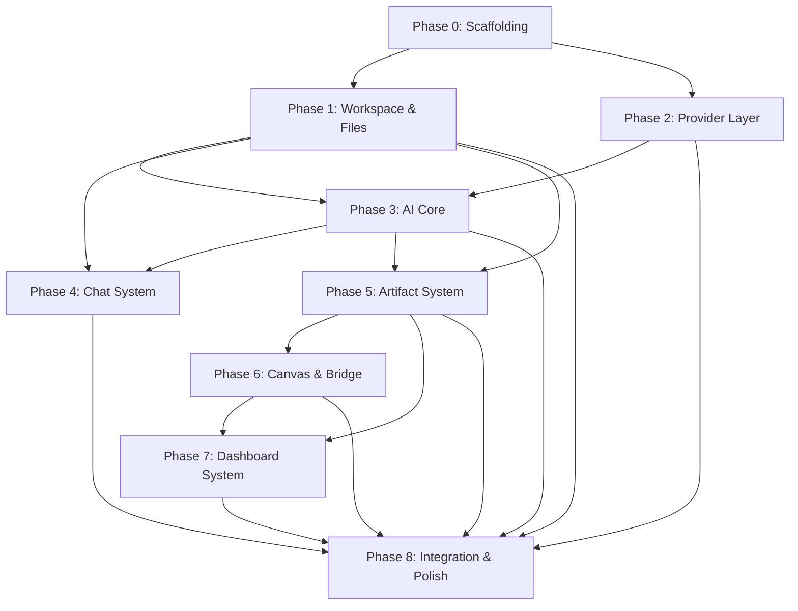

# DHANTI — Orchestrator Build Instructions

**Version:** 1.0
**Purpose:** Single-source master plan for any AI Orchestrator (or developer) to build the DHANTI application from scratch.
**Scope:** MVP only. Future features are explicitly excluded.

---

> [!IMPORTANT]
> This document is the **single entry point** for building DHANTI. Each task is self-contained, has clear inputs/outputs, and references the original design docs when deeper context is needed. **Do not start Phase N+1 until Phase N passes its acceptance criteria.**

---

# 1. What is DHANTI? (30-Second Summary)

DHANTI is an **AI-powered data & document workspace**. Users upload files (CSV, XLSX, PDF), ask questions in natural language, and DHANTI's multi-agent AI system produces **Artifacts** (dashboards, insights, reports, HTML apps) that live inside a **Workspace**.

**Core loop:**
```
Upload File → AI Analyzes → Generates Artifact → User Interacts → AI Revises
```

**Key architectural constraints:**
- Everything lives inside a Workspace (no cross-workspace leaks)
- All AI output = Artifact (versioned, storable, reusable)
- All AI-generated code runs in a sandboxed Canvas (never in the main app)
- Canvas ↔ Main App communication only through Bridge API
- AI uses specialized Agents coordinated by an Orchestrator (no god-agent)
- Provider-agnostic: swap LLM/Embedding/Vector vendors without code changes

---

# 2. Technology Stack (MVP — Non-Negotiable)

| Layer | Technology | Notes |
|---|---|---|
| Frontend | **Next.js** (App Router) | TypeScript, React 18+ |
| Backend | **FastAPI** (Python) | Async, modular routers |
| AI Framework | **LangGraph** | Multi-agent orchestration |
| LLM Provider | **OpenRouter** | Default model: Qwen 3 |
| Embedding | **Hugging Face Inference** | Model: BAAI/bge-m3 |
| Vector DB | **Qdrant Cloud** | Semantic search & retrieval |
| Database | **PostgreSQL** (Neon) | All relational data |
| Object Storage | **Supabase Storage** | Files, large artifact content |
| Cache | **Upstash Redis** | Session, dataset cache |
| Charts | **Apache ECharts** | All visualizations |
| Deployment | Vercel (FE) + Railway/Render (BE) | Separate scaling |

> [!NOTE]
> Ref: [02-system-architecture.md § 13](file:///home/ega/Documents/Project/Dhanti/docs/02-system-architecture.md)

---

# 3. Architecture Overview

```
┌─────────────────────────────────────────────────────────┐
│                    PRESENTATION LAYER                    │
│  Next.js: Workspace UI, Chat, Dashboard Viewer, Canvas  │
└────────────────────────┬────────────────────────────────┘
                         │ REST / WebSocket
┌────────────────────────▼────────────────────────────────┐
│                    APPLICATION LAYER                     │
│  FastAPI: Workspace, Chat, Artifact, File, Auth APIs    │
└──────┬──────────────────────────────────┬───────────────┘
       │                                  │
┌──────▼──────────┐              ┌────────▼───────────────┐
│    AI LAYER     │              │   CANVAS RUNTIME       │
│  LangGraph:     │              │   Sandboxed iframe      │
│  Orchestrator,  │              │   runs executable       │
│  Agents, Tools, │              │   artifacts             │
│  Planning       │              │         │               │
└──────┬──────────┘              │    Bridge API           │
       │                         │    (postMessage)        │
┌──────▼──────────┐              └────────────────────────┘
│ PROVIDER LAYER  │
│ LLM, Embedding, │
│ Vector, Storage  │
└─────────────────┘
```

---

# 4. Phase Breakdown

## Overview

| Phase | Name | Depends On | Goal |
|---|---|---|---|
| **0** | Project Scaffolding | — | Monorepo, CI, env, DB schema |
| **1** | Workspace & Files | Phase 0 | Create workspaces, upload/parse files |
| **2** | Provider Layer | Phase 0 | Abstracted LLM, embedding, vector, storage clients |
| **3** | AI Core (Orchestrator + Agents) | Phase 1, 2 | Intent → Plan → Agent → Artifact pipeline |
| **4** | Chat System | Phase 1, 3 | Conversational interface with streaming |
| **5** | Artifact System | Phase 1, 3 | CRUD, versioning, relations for all artifact types |
| **6** | Canvas Runtime & Bridge API | Phase 5 | Sandboxed execution of executable artifacts |
| **7** | Dashboard System | Phase 5, 6 | Dashboard artifact generation & rendering |
| **8** | Integration & Polish | Phase 1–7 | End-to-end flows, error handling, UX polish |

---

## Phase 0 — Project Scaffolding

**Goal:** Working monorepo with both apps booting, database migrated, env configured.

### Tasks

| # | Task | Output |
|---|---|---|
| 0.1 | Create monorepo structure: `/frontend` (Next.js), `/backend` (FastAPI), `/docs`, `/shared` | Directory tree |
| 0.2 | Initialize Next.js app with TypeScript, App Router, ESLint | `frontend/` boots on `localhost:3000` |
| 0.3 | Initialize FastAPI app with `uvicorn`, project structure: `app/api/`, `app/services/`, `app/models/`, `app/core/` | `backend/` boots on `localhost:8000` |
| 0.4 | Set up `.env` files for both apps with all provider keys (empty placeholders ok) | `.env.example` in both |
| 0.5 | Design & create PostgreSQL schema (see § 4.1 below) | Alembic migrations |
| 0.6 | Configure Supabase Storage bucket for file uploads | Bucket `dhanti-files` exists |
| 0.7 | Configure Qdrant collection for embeddings | Collection `dhanti_vectors` exists |
| 0.8 | Set up Redis connection (Upstash) | Ping test passes |

#### 4.1 — Core Database Schema (PostgreSQL)

```sql
-- Workspaces
workspaces (
  id UUID PK,
  name TEXT NOT NULL,
  description TEXT,
  settings JSONB DEFAULT '{}',
  created_at TIMESTAMPTZ,
  updated_at TIMESTAMPTZ
)

-- Files
files (
  id UUID PK,
  workspace_id UUID FK → workspaces,
  name TEXT NOT NULL,
  type TEXT NOT NULL,          -- csv, xlsx, xls, pdf
  size_bytes BIGINT,
  storage_path TEXT NOT NULL,  -- Supabase path
  status TEXT DEFAULT 'uploaded', -- uploaded, parsing, parsed, error
  metadata JSONB DEFAULT '{}',
  created_at TIMESTAMPTZ
)

-- Datasets (parsed structured data)
datasets (
  id UUID PK,
  workspace_id UUID FK → workspaces,
  file_id UUID FK → files,
  name TEXT NOT NULL,
  columns JSONB NOT NULL,      -- [{name, type, stats}]
  row_count INTEGER,
  profile JSONB DEFAULT '{}',  -- profiling results
  data_path TEXT,              -- storage path to parquet/json
  created_at TIMESTAMPTZ
)

-- Documents (parsed PDFs)
documents (
  id UUID PK,
  workspace_id UUID FK → workspaces,
  file_id UUID FK → files,
  name TEXT,
  page_count INTEGER,
  structure JSONB,             -- headings, sections
  chunks JSONB,                -- [{text, page, embedding_id}]
  created_at TIMESTAMPTZ
)

-- Artifacts
artifacts (
  id UUID PK,
  workspace_id UUID FK → workspaces,
  type TEXT NOT NULL,           -- text, dataset, visualization, dashboard, executable, workflow
  title TEXT NOT NULL,
  description TEXT,
  content JSONB NOT NULL,       -- type-specific payload
  version INTEGER DEFAULT 1,
  parent_id UUID FK → artifacts (self-ref for versioning),
  permissions JSONB DEFAULT '{"read":true,"write":true,"execute":false}',
  relations JSONB DEFAULT '[]',
  metadata JSONB DEFAULT '{}',
  created_at TIMESTAMPTZ,
  updated_at TIMESTAMPTZ
)

-- Chat conversations
conversations (
  id UUID PK,
  workspace_id UUID FK → workspaces,
  title TEXT,
  created_at TIMESTAMPTZ,
  updated_at TIMESTAMPTZ
)

-- Chat messages
messages (
  id UUID PK,
  conversation_id UUID FK → conversations,
  role TEXT NOT NULL,           -- user, assistant, system
  content TEXT NOT NULL,
  artifacts JSONB DEFAULT '[]', -- artifact IDs referenced
  metadata JSONB DEFAULT '{}', -- execution plan, agent info
  created_at TIMESTAMPTZ
)

-- AI Memory
memories (
  id UUID PK,
  workspace_id UUID FK → workspaces,
  category TEXT NOT NULL,       -- workspace, user_preference, artifact
  content TEXT NOT NULL,
  embedding_id TEXT,            -- vector DB reference
  created_at TIMESTAMPTZ
)
```

> [!NOTE]
> Ref: [06-artifact-spec.md § 3](file:///home/ega/Documents/Project/Dhanti/docs/06-artifact-spec.md), [08-dashboard-schema.md](file:///home/ega/Documents/Project/Dhanti/docs/08-dashboard-schema.md)

### Acceptance Criteria
- [ ] `npm run dev` in `/frontend` → page loads
- [ ] `uvicorn app.main:app` in `/backend` → `/health` returns 200
- [ ] All DB tables created via migration
- [ ] Storage bucket accessible
- [ ] Vector collection exists
- [ ] Redis ping succeeds

---

## Phase 1 — Workspace & File Management

**Goal:** User can create a workspace, upload files, and see parsed results.

### Tasks

| # | Task | Details |
|---|---|---|
| 1.1 | **Workspace CRUD API** (FastAPI) | `POST/GET/PUT/DELETE /api/workspaces` |
| 1.2 | **File Upload API** | `POST /api/workspaces/{id}/files` — validate type (CSV, XLSX, XLS, PDF), upload to Supabase, create `files` row |
| 1.3 | **File Parser Service** | Background task: detect file type → parse CSV/XLSX with pandas → extract columns, types, row count → create `datasets` row. For PDF → extract text, pages, structure → create `documents` row |
| 1.4 | **Dataset Profiling Service** | After parsing: compute stats per column (min, max, mean, median, mode, null count, unique count, distribution) → update `datasets.profile` |
| 1.5 | **Workspace UI** | Next.js pages: workspace list, workspace detail (sidebar with files, chat, artifacts) |
| 1.6 | **File Upload UI** | Drag-drop + click upload component. Show parsing progress. Display parsed dataset preview (first 100 rows) |
| 1.7 | **File Explorer Panel** | Left sidebar: list files, datasets, documents in the workspace. Click to preview |

### API Contracts

```
POST   /api/workspaces                     → { id, name, ... }
GET    /api/workspaces                     → [{ id, name, ... }]
GET    /api/workspaces/:id                 → { id, name, files, datasets, documents, artifacts }
POST   /api/workspaces/:id/files           → { file_id, status: "parsing" }
GET    /api/workspaces/:id/files           → [{ id, name, type, status }]
GET    /api/workspaces/:id/datasets        → [{ id, name, columns, row_count, profile }]
GET    /api/workspaces/:id/datasets/:id    → { full dataset with sample rows }
GET    /api/workspaces/:id/documents       → [{ id, name, page_count }]
GET    /api/workspaces/:id/documents/:id   → { structure, chunks }
```

### Acceptance Criteria
- [ ] Create workspace → workspace appears in list
- [ ] Upload CSV → file parsed → dataset with columns & stats visible
- [ ] Upload XLSX → same as CSV
- [ ] Upload PDF → document with pages & text visible
- [ ] Invalid file type → clear error message
- [ ] File > 50MB → rejected with message

> [!NOTE]
> Ref: [00-product-principles.md § 1 (Workspace First)](file:///home/ega/Documents/Project/Dhanti/docs/00-product-principles.md), [01-product-prd.md § 7–8](file:///home/ega/Documents/Project/Dhanti/docs/01-product-prd.md)

---

## Phase 2 — Provider Layer

**Goal:** Abstracted, swappable clients for all external services.

### Tasks

| # | Task | Details |
|---|---|---|
| 2.1 | **LLM Provider Interface** | Abstract base: `generate(messages, model, temperature) → str`. Implementation: `OpenRouterProvider` calling OpenRouter API |
| 2.2 | **Embedding Provider Interface** | Abstract base: `embed(texts) → list[list[float]]`. Implementation: `HuggingFaceEmbeddingProvider` using bge-m3 |
| 2.3 | **Vector Provider Interface** | Abstract base: `upsert(id, vector, metadata)`, `search(vector, top_k) → results`. Implementation: `QdrantProvider` |
| 2.4 | **Storage Provider Interface** | Abstract base: `upload(path, data)`, `download(path)`, `delete(path)`. Implementation: `SupabaseStorageProvider` |
| 2.5 | **Provider Manager** | Singleton registry. `get_llm()`, `get_embedding()`, `get_vector()`, `get_storage()`. Config-driven provider selection |
| 2.6 | **Provider Tests** | Integration tests for each provider with real API calls (use test keys) |

### Interface Pattern (Python)

```python
# All providers follow this pattern
class LLMProvider(ABC):
    @abstractmethod
    async def generate(self, messages: list[dict], model: str = None, temperature: float = 0.7) -> str: ...
    
    @abstractmethod
    async def generate_stream(self, messages: list[dict], model: str = None) -> AsyncIterator[str]: ...

class ProviderManager:
    def get_llm(self) -> LLMProvider: ...
    def get_embedding(self) -> EmbeddingProvider: ...
    def get_vector(self) -> VectorProvider: ...
    def get_storage(self) -> StorageProvider: ...
```

### Acceptance Criteria
- [ ] `LLMProvider.generate()` returns text from OpenRouter
- [ ] `LLMProvider.generate_stream()` streams tokens
- [ ] `EmbeddingProvider.embed(["hello"])` returns vector of correct dimension
- [ ] `VectorProvider.upsert() + search()` returns relevant results
- [ ] Changing provider in config works without code changes

> [!NOTE]
> Ref: [03-ai-architecture.md § 11 (Provider Layer)](file:///home/ega/Documents/Project/Dhanti/docs/03-ai-architecture.md)

---

## Phase 3 — AI Core (Orchestrator + Agents)

**Goal:** Working AI pipeline: prompt → intent → plan → agent execution → artifact output.

### Tasks

| # | Task | Details |
|---|---|---|
| 3.1 | **Intent Analyzer** | LLM-based classifier. Input: user prompt + workspace context summary. Output: `{ intent, complexity, required_agents[], required_data[] }`. Intents: `data_analysis`, `document_analysis`, `dashboard_generation`, `code_generation`, `question_answer`, `summarize`, `compare` |
| 3.2 | **Context Builder** | Gathers relevant context from workspace: recent conversation, file metadata, dataset schemas, document summaries, existing artifacts. Budget: keep under token limit. Uses vector search for relevance |
| 3.3 | **Planning Engine** | LLM-based. Input: intent + context. Output: Execution Plan (list of tasks with agent assignments, dependencies, expected outputs). Simple requests → single task. Complex → multi-step |
| 3.4 | **AI Orchestrator (LangGraph)** | State machine that executes the plan step-by-step. Manages agent selection, passes outputs between steps, handles retries, generates final artifact |
| 3.5 | **File Agent** | Tools: read_csv, read_excel, detect_encoding, infer_schema. Output: parsed data + metadata |
| 3.6 | **Dataset Agent** | Tools: profile_dataset, compute_stats, detect_outliers, detect_missing. Output: Dataset Profile artifact |
| 3.7 | **Document Agent** | Tools: parse_pdf, chunk_text, embed_chunks (via embedding provider), index_chunks (via vector provider). Output: Document artifact, ready for RAG |
| 3.8 | **Insight Agent** | Uses LLM reasoning + dataset profile. Output: Insight artifact (patterns, trends, anomalies, recommendations) |
| 3.9 | **Visualization Agent** | Input: dataset + insight. Chooses best chart type (rule-based + LLM). Output: ECharts config JSON |
| 3.10 | **Dashboard Agent** | Input: dataset + insights + viz configs. Produces dashboard layout with widgets. Output: Dashboard artifact (JSON matching schema in doc 08) |
| 3.11 | **Code Generation Agent** | Input: dashboard/viz artifact. Generates self-contained HTML+CSS+JS. Uses ECharts CDN. Output: Executable artifact |
| 3.12 | **Artifact Generator** | Takes agent output → validates against artifact schema → assigns version → saves to DB + storage |
| 3.13 | **Tool Registry** | Central registry of all tools. Agents request tools by name. Tools are deterministic functions |

### Agent I/O Contracts

Every agent receives:
```json
{
  "task_id": "string",
  "workspace_id": "string",
  "input": { /* task-specific */ },
  "context": { /* relevant workspace context */ },
  "constraints": { /* token budget, time limit */ },
  "expected_output": { /* artifact type hint */ }
}
```

Every agent returns:
```json
{
  "task_id": "string",
  "status": "success | partial | error",
  "output": { /* artifact content */ },
  "artifact_type": "string",
  "metadata": { /* execution details */ }
}
```

### Acceptance Criteria
- [ ] Prompt "Analyze this dataset" → Intent = `data_analysis`, Plan has dataset + insight agents
- [ ] Prompt "Summarize this PDF" → Intent = `summarize`, Plan has document agent
- [ ] Prompt "Create a dashboard from sales.xlsx" → Full pipeline: file → dataset → insight → viz → dashboard → code gen
- [ ] Each agent runs independently, returns structured output
- [ ] Artifact saved to DB with correct type, version = 1
- [ ] Error in one agent → graceful fallback, partial result returned

> [!NOTE]
> Ref: [03-ai-architecture.md](file:///home/ega/Documents/Project/Dhanti/docs/03-ai-architecture.md), [07-agent-specification.md](file:///home/ega/Documents/Project/Dhanti/docs/07-agent-specification.md)

---

## Phase 4 — Chat System

**Goal:** User can chat with AI, see streaming responses, and receive artifacts inline.

### Tasks

| # | Task | Details |
|---|---|---|
| 4.1 | **Conversation CRUD API** | `POST/GET /api/workspaces/:id/conversations`. `POST /api/conversations/:id/messages` |
| 4.2 | **Chat Endpoint with Streaming** | `POST /api/conversations/:id/chat` — accepts prompt, triggers AI pipeline, streams response via SSE (Server-Sent Events). Stream includes: text chunks, status updates, artifact references |
| 4.3 | **Chat UI Component** | Message list (user + assistant), input bar, typing indicator, streaming text display |
| 4.4 | **Artifact Inline Preview** | When AI generates an artifact, show inline preview in chat: chart thumbnail, dashboard link, insight card |
| 4.5 | **Conversation Memory** | Store conversation history, include recent messages in context building |
| 4.6 | **AI Memory Service** | Extract memorable facts from conversations (workspace goals, preferences). Store in `memories` table + vector index. Retrieve relevant memories during context building |

### Streaming Protocol (SSE)

```
event: status
data: {"phase": "analyzing", "message": "Reading dataset..."}

event: text
data: {"content": "Based on your sales data, "}

event: text
data: {"content": "I found 3 key trends:"}

event: artifact
data: {"artifact_id": "abc-123", "type": "insight", "title": "Sales Trends"}

event: artifact
data: {"artifact_id": "def-456", "type": "dashboard", "title": "Sales Dashboard"}

event: done
data: {}
```

### Acceptance Criteria
- [ ] Send message → streaming response appears word-by-word
- [ ] AI references workspace files in answers
- [ ] Generated artifacts appear as inline cards in chat
- [ ] Clicking artifact card opens artifact viewer
- [ ] Previous messages maintain context
- [ ] Memory persists across conversations within same workspace

> [!NOTE]
> Ref: [03-ai-architecture.md § 15 (Streaming)](file:///home/ega/Documents/Project/Dhanti/docs/03-ai-architecture.md), [03-ai-architecture.md § 13 (Memory)](file:///home/ega/Documents/Project/Dhanti/docs/03-ai-architecture.md)

---

## Phase 5 — Artifact System

**Goal:** Full artifact CRUD, versioning, relations, and viewer UI.

### Tasks

| # | Task | Details |
|---|---|---|
| 5.1 | **Artifact CRUD API** | `POST/GET/PUT /api/workspaces/:id/artifacts`. Support filtering by type |
| 5.2 | **Artifact Versioning** | Every update creates new version (new row with `parent_id` → previous version). `GET /api/artifacts/:id/versions` returns history |
| 5.3 | **Artifact Relations** | Store `relations[]` on artifacts. Types: `derived`, `depends_on`, `visualizes`, `extends`. API to query lineage |
| 5.4 | **Artifact Validation** | Validate content against type-specific JSON schemas before save |
| 5.5 | **Artifact Viewer UI** | Route: `/workspace/:id/artifact/:id`. Renders artifact based on type: text → markdown, dataset → table, visualization → chart, dashboard → redirect to canvas, executable → redirect to canvas |
| 5.6 | **Artifact List Panel** | Right sidebar or tab in workspace. Shows all artifacts grouped by type. Search/filter |

### Artifact Type Schemas (Validation)

Refer to: [06-artifact-spec.md § 4](file:///home/ega/Documents/Project/Dhanti/docs/06-artifact-spec.md)

Each type has a required `content` structure:
- **text**: `{ text: string, format: "markdown"|"plain" }`
- **dataset**: `{ columns: [], rows: [], schema: {}, stats: {} }`
- **visualization**: `{ library: "echarts", config: {}, data_source: "dataset_id" }`
- **dashboard**: `{ layout: {}, widgets: [], data_sources: [], filters: [] }`
- **executable**: `{ runtime: "html", entry: string, assets: [], permissions: {} }`
- **workflow**: `{ steps: [], dependencies: [], execution_mode: "sequential"|"parallel" }`

### Acceptance Criteria
- [ ] Create artifact → saved with version 1
- [ ] Update artifact → version 2 created, version 1 still accessible
- [ ] Artifact with invalid schema → rejected with validation error
- [ ] Artifact viewer renders each type correctly
- [ ] Artifact lineage: can trace Dashboard → back to Dataset

> [!NOTE]
> Ref: [06-artifact-spec.md](file:///home/ega/Documents/Project/Dhanti/docs/06-artifact-spec.md)

---

## Phase 6 — Canvas Runtime & Bridge API

**Goal:** Executable artifacts run safely in a sandboxed iframe with controlled data access.

### Tasks

| # | Task | Details |
|---|---|---|
| 6.1 | **Canvas Component** | Next.js component: renders a sandboxed `<iframe>` with `sandbox="allow-scripts"`. No `allow-same-origin`. Loads executable artifact HTML |
| 6.2 | **Runtime Manager** | JS class in parent. Manages canvas lifecycle: load artifact, switch artifact, destroy, resize |
| 6.3 | **Artifact Loader** | Reads artifact metadata → determines runtime type → prepares HTML bundle for injection |
| 6.4 | **Bridge Client (injected into iframe)** | JS SDK injected into every artifact before execution. Provides: `bridge.dataset.get()`, `bridge.artifact.save()`, `bridge.workspace.emit()`, `bridge.events.subscribe()`. Communicates via `postMessage` |
| 6.5 | **Bridge Gateway (parent side)** | Listens for `postMessage` from iframe. Validates origin. Routes to Permission Validator → Service Router |
| 6.6 | **Permission Validator** | Reads artifact's `permissions` field. Blocks unauthorized operations. Logs violations |
| 6.7 | **Service Router** | Maps bridge requests to backend API calls: `dataset.get → GET /api/datasets/:id`, `artifact.save → PUT /api/artifacts/:id` |
| 6.8 | **Error Boundary** | Catches runtime errors in canvas. Shows fallback UI. Reports error via bridge. Does NOT crash parent app |
| 6.9 | **Resource Limits** | Execution timeout (30s), DOM node limit (10,000), re-render limit |

### Bridge API Protocol (postMessage)

```javascript
// Canvas → Parent (request)
{
  type: "bridge_request",
  id: "req-123",
  module: "dataset",
  method: "get",
  params: { dataset_id: "abc" }
}

// Parent → Canvas (response)
{
  type: "bridge_response",
  id: "req-123",
  status: "success",
  data: { columns: [...], rows: [...] }
}
```

### Security Rules (Non-Negotiable)

- iframe `sandbox` attribute: `allow-scripts` only. NO `allow-same-origin`
- No `window.parent` access from canvas
- No `localStorage`, `sessionStorage`, `document.cookie` access
- No arbitrary `fetch` — all data through bridge
- No `WebSocket` from canvas
- Bridge validates every request against artifact permissions
- One artifact failure must NOT affect other artifacts or the main app

### Acceptance Criteria
- [ ] Executable artifact HTML renders in canvas
- [ ] `bridge.dataset.get()` returns data from backend
- [ ] `bridge.artifact.save()` persists changes
- [ ] Unauthorized bridge call → rejected with error
- [ ] JS error in canvas → error boundary shown, main app unaffected
- [ ] Infinite loop in canvas → timeout kills execution, main app unaffected

> [!NOTE]
> Ref: [04-canvas-runtime.md](file:///home/ega/Documents/Project/Dhanti/docs/04-canvas-runtime.md), [05-bridge-api.md](file:///home/ega/Documents/Project/Dhanti/docs/05-bridge-api.md)

---

## Phase 7 — Dashboard System

**Goal:** AI generates interactive dashboards that render in Canvas with working filters and data binding.

### Tasks

| # | Task | Details |
|---|---|---|
| 7.1 | **Dashboard Schema Implementation** | Implement the dashboard JSON schema: layout (12-col grid), widgets (chart, metric, table, text, filter), data_sources, filters, interactions, theme |
| 7.2 | **Dashboard Runtime Engine** | Runs inside Canvas. Reads dashboard JSON → renders grid layout → instantiates widget components → binds data via bridge |
| 7.3 | **Widget Engine** | Component registry: ChartWidget (ECharts), MetricWidget (KPI card), TableWidget (sortable/paginated), TextWidget (markdown), FilterWidget (dropdown/range/date) |
| 7.4 | **Data Binding System** | Widgets reference `data_source` IDs → runtime fetches data via `bridge.dataset.get()` → populates widget |
| 7.5 | **Filter System** | Global filters affect all widgets. Local filters affect single widget. Filter change → re-fetch data → re-render affected widgets |
| 7.6 | **Cross-Widget Interaction** | Click on chart element → filters table. Interaction schema: `{ source_widget, event, target_widgets, action }` |
| 7.7 | **Theme System** | Theme JSON: `{ mode, primary_color, accent_color, font, spacing }`. AI generates theme based on data domain |
| 7.8 | **Dashboard Viewer Page** | Full-screen dashboard view at `/workspace/:id/dashboard/:id`. Renders in Canvas |

### Dashboard JSON Example

```json
{
  "type": "dashboard",
  "title": "Sales Overview",
  "layout": { "type": "grid", "columns": 12 },
  "widgets": [
    {
      "widget_id": "w1",
      "type": "metric",
      "title": "Total Revenue",
      "position": { "x": 0, "y": 0, "w": 3, "h": 2 },
      "data_source": "ds1",
      "config": { "value": "sum(revenue)", "format": "currency", "trend": true }
    },
    {
      "widget_id": "w2",
      "type": "chart",
      "title": "Monthly Sales",
      "position": { "x": 3, "y": 0, "w": 9, "h": 4 },
      "data_source": "ds1",
      "config": { "chart_type": "line", "options": { /* ECharts config */ } }
    },
    {
      "widget_id": "w3",
      "type": "table",
      "title": "Top Products",
      "position": { "x": 0, "y": 4, "w": 12, "h": 4 },
      "data_source": "ds1",
      "config": { "columns": ["product", "revenue", "quantity"], "sortable": true, "pagination": true }
    }
  ],
  "data_sources": [{ "source_id": "ds1", "type": "dataset", "ref": "dataset-uuid" }],
  "filters": [{ "type": "filter", "filter_type": "range", "field": "date" }],
  "theme": { "mode": "dark", "primary_color": "#6366f1", "accent_color": "#22d3ee", "font": "Inter" }
}
```

### Acceptance Criteria
- [ ] Dashboard JSON renders grid layout with correct widget positions
- [ ] KPI metric widget shows formatted value with trend indicator
- [ ] Chart widget renders ECharts visualization with real data
- [ ] Table widget shows paginated, sortable data
- [ ] Filter changes → all widgets update
- [ ] Dashboard runs entirely in Canvas via Bridge API
- [ ] Theme changes apply globally

> [!NOTE]
> Ref: [08-dashboard-schema.md](file:///home/ega/Documents/Project/Dhanti/docs/08-dashboard-schema.md)

---

## Phase 8 — Integration & Polish

**Goal:** End-to-end user journeys work. Error handling is robust. UI is polished.

### Tasks

| # | Task | Details |
|---|---|---|
| 8.1 | **E2E Flow: Data Analysis** | Upload CSV → "Analyze this data" → Insight artifact + viz artifact in chat |
| 8.2 | **E2E Flow: Dashboard Generation** | Upload XLSX → "Create a dashboard" → Full dashboard in Canvas |
| 8.3 | **E2E Flow: Document Q&A** | Upload PDF → "What does this document say about X?" → Answer with citations |
| 8.4 | **E2E Flow: Dashboard Revision** | View dashboard → "Change the bar chart to a line chart" → Dashboard v2 |
| 8.5 | **Error Handling (AI)** | Provider timeout → retry → fallback → user-friendly error |
| 8.6 | **Error Handling (Canvas)** | Runtime crash → error boundary → retry button |
| 8.7 | **Error Handling (Upload)** | Corrupt file → clear error. Wrong type → clear error |
| 8.8 | **Loading States** | Skeleton loaders for all async operations. Progress indicators for file parsing |
| 8.9 | **Responsive Design** | Mobile-friendly workspace, chat, and dashboard views |
| 8.10 | **Workspace Settings** | Settings page: workspace name, description, AI preferences (language, model) |

### Acceptance Criteria
- [ ] All 4 E2E flows complete without errors
- [ ] Time from file upload to first insight < 30 seconds (medium dataset)
- [ ] All error states show user-friendly messages
- [ ] No blank screens or loading spinners that hang indefinitely
- [ ] Works on desktop (1280px+) and tablet (768px+)

---

# 5. Key Design Rules (Must Follow)

These rules are derived from [00-product-principles.md](file:///home/ega/Documents/Project/Dhanti/docs/00-product-principles.md) and are **non-negotiable**:

| # | Rule | Violation Example |
|---|---|---|
| 1 | **All data belongs to a Workspace** | ❌ Global file list outside workspace |
| 2 | **All AI output is an Artifact** | ❌ AI returns plain text that isn't saved |
| 3 | **AI always uses workspace context** | ❌ AI answers using only the last prompt |
| 4 | **Each agent has ONE responsibility** | ❌ Single agent does analysis + dashboard |
| 5 | **All code runs in Canvas sandbox** | ❌ AI-generated JS runs in main app |
| 6 | **Canvas only talks through Bridge** | ❌ Canvas makes direct fetch to backend |
| 7 | **Providers are swappable** | ❌ OpenRouter URL hardcoded in agent |
| 8 | **No user data used for training** | ❌ Logging user data to analytics |
| 9 | **Artifacts are versioned** | ❌ Overwriting artifact without new version |
| 10 | **Agents never talk to each other directly** | ❌ Dataset agent calls insight agent |

---

# 6. File & Directory Structure (Recommended)

```
Dhanti/
├── frontend/                          # Next.js App
│   ├── src/
│   │   ├── app/                       # App Router pages
│   │   │   ├── page.tsx               # Landing / workspace list
│   │   │   ├── workspace/
│   │   │   │   └── [id]/
│   │   │   │       ├── page.tsx       # Workspace main view
│   │   │   │       ├── chat/
│   │   │   │       ├── dashboard/
│   │   │   │       └── artifact/
│   │   ├── components/
│   │   │   ├── workspace/             # Workspace UI components
│   │   │   ├── chat/                  # Chat interface components
│   │   │   ├── canvas/                # Canvas runtime components
│   │   │   ├── dashboard/             # Dashboard viewer components
│   │   │   ├── artifacts/             # Artifact viewer/list
│   │   │   └── ui/                    # Shared UI primitives
│   │   ├── lib/
│   │   │   ├── api.ts                 # Backend API client
│   │   │   ├── bridge.ts              # Bridge Gateway (parent-side)
│   │   │   └── types.ts              # Shared TypeScript types
│   │   └── styles/
│   │       └── globals.css
│   ├── public/
│   │   └── bridge-client.js           # Injected into canvas iframe
│   └── package.json
│
├── backend/                           # FastAPI App
│   ├── app/
│   │   ├── main.py                    # FastAPI entry point
│   │   ├── core/
│   │   │   ├── config.py              # Settings & env vars
│   │   │   ├── database.py            # DB connection
│   │   │   └── security.py            # Auth helpers
│   │   ├── api/
│   │   │   ├── workspaces.py          # Workspace endpoints
│   │   │   ├── files.py               # File upload endpoints
│   │   │   ├── datasets.py            # Dataset endpoints
│   │   │   ├── documents.py           # Document endpoints
│   │   │   ├── artifacts.py           # Artifact endpoints
│   │   │   ├── conversations.py       # Chat endpoints
│   │   │   └── chat.py                # AI chat + streaming
│   │   ├── services/
│   │   │   ├── workspace_service.py
│   │   │   ├── file_service.py        # Parse, validate, store
│   │   │   ├── dataset_service.py     # Profile, stats
│   │   │   ├── document_service.py    # PDF parse, chunk, embed
│   │   │   ├── artifact_service.py    # CRUD, version, validate
│   │   │   ├── memory_service.py      # AI memory management
│   │   │   └── chat_service.py        # Conversation management
│   │   ├── ai/
│   │   │   ├── orchestrator.py        # LangGraph state machine
│   │   │   ├── intent_analyzer.py
│   │   │   ├── context_builder.py
│   │   │   ├── planning_engine.py
│   │   │   ├── artifact_generator.py
│   │   │   ├── agents/
│   │   │   │   ├── base_agent.py      # Abstract agent class
│   │   │   │   ├── file_agent.py
│   │   │   │   ├── dataset_agent.py
│   │   │   │   ├── document_agent.py
│   │   │   │   ├── insight_agent.py
│   │   │   │   ├── visualization_agent.py
│   │   │   │   ├── dashboard_agent.py
│   │   │   │   └── code_generation_agent.py
│   │   │   └── tools/
│   │   │       ├── file_tools.py
│   │   │       ├── dataset_tools.py
│   │   │       ├── document_tools.py
│   │   │       ├── workspace_tools.py
│   │   │       └── visualization_tools.py
│   │   ├── providers/
│   │   │   ├── base.py                # Abstract provider interfaces
│   │   │   ├── manager.py             # Provider registry
│   │   │   ├── llm/
│   │   │   │   └── openrouter.py
│   │   │   ├── embedding/
│   │   │   │   └── huggingface.py
│   │   │   ├── vector/
│   │   │   │   └── qdrant.py
│   │   │   └── storage/
│   │   │       └── supabase.py
│   │   └── models/
│   │       ├── workspace.py           # SQLAlchemy / Pydantic models
│   │       ├── file.py
│   │       ├── dataset.py
│   │       ├── document.py
│   │       ├── artifact.py
│   │       ├── conversation.py
│   │       └── memory.py
│   ├── alembic/                       # DB migrations
│   ├── tests/
│   └── requirements.txt
│
├── docs/                              # Design documentation
└── shared/                            # Shared types/constants (optional)
```

---

# 7. Dependency Graph (Visual)



**Parallelizable:** Phase 1 and Phase 2 can run in parallel after Phase 0.

---

# 8. What is NOT in MVP (Explicitly Excluded)

Do NOT build these in any phase:
- ❌ User authentication / multi-user (single-user for MVP)
- ❌ OCR for scanned PDFs
- ❌ Real-time collaboration
- ❌ Workflow automation
- ❌ ETL pipelines
- ❌ Database connectors (SQL, Google Sheets, etc.)
- ❌ Multi-workspace organizations
- ❌ Custom AI model training
- ❌ React/Vue/Svelte canvas runtimes (HTML only for MVP)
- ❌ Plugin system (design for it, don't build it)

> [!NOTE]
> Ref: [01-product-prd.md § 13 (Non Goals)](file:///home/ega/Documents/Project/Dhanti/docs/01-product-prd.md)

---

# 9. How to Use This Document

1. **Start at Phase 0.** Complete all tasks and pass acceptance criteria.
2. **Move to Phase 1 + 2 in parallel.** These are independent.
3. **Phase 3 requires both 1 and 2.** This is the most complex phase.
4. **Phase 4, 5 can proceed once Phase 3 has basic agents working.**
5. **Phase 6 requires Phase 5.** Canvas needs artifacts to render.
6. **Phase 7 requires Phase 5 + 6.** Dashboards need canvas.
7. **Phase 8 is integration.** All prior phases must be substantially complete.

For each task:
- Read the task description
- Reference the linked original doc if you need deeper context
- Implement
- Verify against acceptance criteria
- Move to next task

> [!TIP]
> When delegating to sub-agents or other orchestrators, assign **one phase at a time**. Each phase is designed to be a self-contained work unit.
